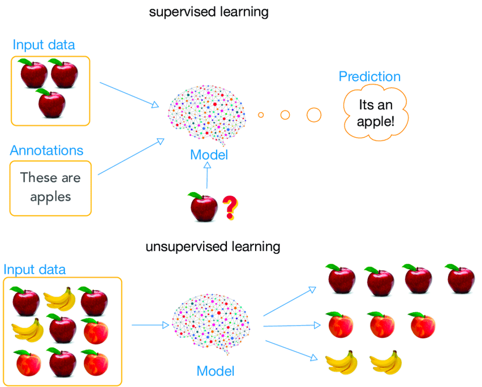
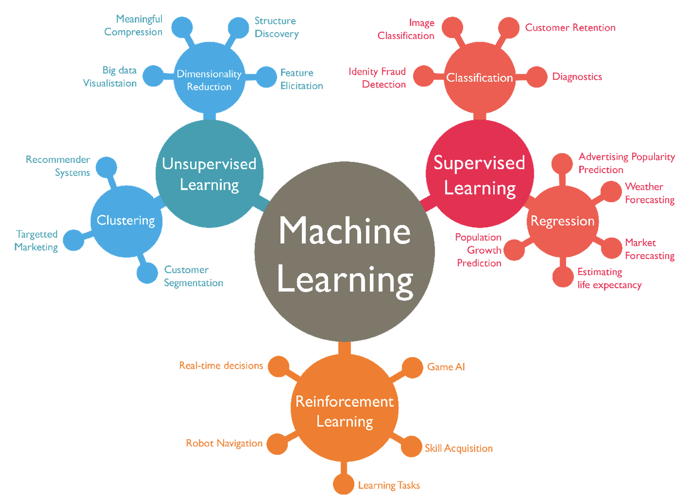

## Introduction to Machine Learning

### What is Machine Learning?
**Machine learning** (ML) is generally recognized as a subset of **Artificial Intelligence** (AI). There are many ways that AI and ML are defined and represented:

<!--

-->

 Most people know machine learning can be useful for automating and streamlining tasks that can be arduous for humans. Machine learning is much more than that - a skilled practitioner can allow the data to "speak for itself," find higher-level relationships, and new representations of your dataset that bring valuable information to light.

### Why has Machine Learning become so common?

There have been major changes to the landscape:
- Dramatic increase in the volume and accessibility of data
- Growth in computational capabilities (cloud, GPU, etc.).  Methods that would have been computationally prohibitive in the past are now feasible.
- Major advances in our understanding of how information is derived from data and how it gains context to become “knowledge.”  
- Open source, sharable software environments
- Advanced visualization and data representation

### The growth of machine learning is part of the growth of data science in general.

Most practitioners talk about machine learning and AI under the broader umbrella of "**data science**."  Data science is the interdisciplinary combination of several skill sets:  statistics, subject matter knowledge, computation/programming, and visualization/data representation. 

<!--
>
-->

### What are the types of ML?

Machine Learning is usually expressed in terms of two different categories:  **supervised** and **unsupervised learning**.  Sometimes there is a third category, "**reinforcement learning**," and sometimes reinforcement learning is categorized as a specific type of supervised learning. 

**Supervised learning** is useful when you know what you want, and you just need to provide examples to the model so it can do it for you.  The two broad types of supervised learning.  One is **classification**, where you have pre-defined categories, and the model is supposed to take inputs and assign them to a category.  The other is **regression**, where the model is supposed to find a relationship between your input variables.  A least-squares-fit is a common type of regression, relating the independent variable (x) to the dependent variable (y). This x-y relationship is reflected in most ML models even if they aren't regressive, in that the input variable(s) is typically denoted as 'x' and the model's target output is denoted as 'y'.

**Unsupervised learning** looks for relationships or organizational structure in a dataset.  The primary difference between supervised and unsupervised learning is that the model is not given examples of a "correct" answer to train it.  Instead, the model uses the performance measure, or "cost function," to find the best way to reorganize the data.  

A common type of unsupervised learning is **clustering**, where the model looks for distinct groups within the input set.  Another type is **dimensionality reduction**, where the model tries to find a lower-dimension representation of the data that preserves its essential structure. For large volumes of data with many variables, it is not uncommon to explore dimensionality reduction as a way to make your dataset more manageable.

### What are common applications of ML?

The following diagram represents the types of machine learning for commercial industry. Let's consider what this figure would look like for Heliophysics.  Where does flare and geomagnetic storm forecasting fit in? Feature identification? Classifying solar wind structure?  

